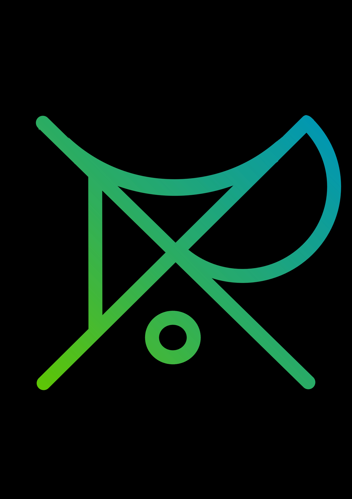
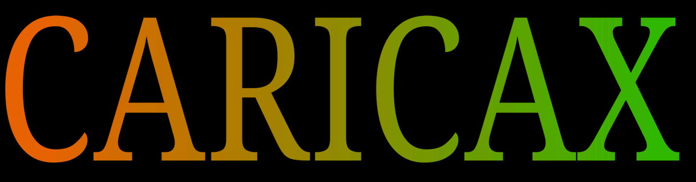

## Caricax Brand Assets & Guidelines (Draft)

**1. Introduction: Our Core**

Caricax exists to democratize sophisticated IT solutions, transforming them from exclusive privileges into common tools for Micro and Small Enterprises (MPEs). We believe Software is a Right, essential for local economic development and liberation from big-tech constraints. Our mission is driven by open-source principles, social impact, quality of life, and transdisciplinarity. We build functional, accessible, and personalized tools to empower local entrepreneurs.

**2. Logo System**

Our logo consists of two primary elements: the Symbol and the Wordmark. They can be used separately or together in approved lockups.

*   **Symbol:** An abstract, geometric form representing connection, networking, or a stylized 'CX'. Features a distinct gradient transitioning approximately from `#28aa6a` to `#25ac6c` (a subtle green-to-green shift).
    *   *(Visual representation available in the attached image)*
*   **Wordmark:** The name "CARICAX" presented in the Noto Serif typeface, featuring a gradient transitioning from `#fe6d03` to `#08c408`.
    *   *(Visual representation available in the attached image)*

**3. Color Palette**

Our palette reflects our connection to both technology and growth/community/open-source, with a touch of warmth and energy. Gradients are a key visual feature.

*   **Primary Colors (Derived from Gradients):**
    *   **Caricax Green (End of Wordmark Gradient):** `#08c408`
    *   **Caricax Orange (Start of Wordmark Gradient):** `#fe6d03`
    *   **Caricax Green (Start of Symbol Gradient):** `#28aa6a`
    *   **Caricax Green (End of Symbol Gradient):** `#25ac6c`
*   **Gradients:**
    *   **Gradient 1 (Symbol):** `#28aa6a` transitioning to `#25ac6c`.
    *   **Gradient 2 (Wordmark):** `#fe6d03` transitioning to `#08c408`.
*   **Secondary Colors (Neutrals):**
    *   **Black:** `#000000` (For text, backgrounds)
    *   **White:** `#FFFFFF` (For text, backgrounds)
    *   **Grey (Optional):** `#A9A9A9`

**4. Typography**

Our typography balances professionalism and accessibility.

*   **Primary Typeface (Headings, Wordmark):** **Noto Serif**
*   **Secondary Typeface (Body Text, UI Elements):** **Hack**

*   **Hierarchy Example:**
    *   **H1 (Page Titles):** Noto Serif, Bold, [Size - e.g., 32px]
    *   **H2 (Section Headings):** Noto Serif, Regular/Bold, [Size - e.g., 24px]
    *   **Body Text:** Hack, Regular, [Size - e.g., 16px]
    *   **Code Snippets:** Hack, Regular, [Size - e.g., 14px]
    *   **UI Elements/Captions:** Hack, Regular/Medium, [Size - e.g., 14px]

**5. Tone of Voice**

Our voice is:

*   OPENSOURCE
*   Passionate & Principled
*   Defiant & Empowering
*   Community-Oriented & Collaborative
*   Technical but Accessible
*   Authentic & Grounded
*   Action-Oriented

**Key Phrases/Attitudes:**

*   "Software as a Right!"
*   "Remote-first"
*   "Open software"
*   "Social impact"
*   "Sustainability"
*   "Accessibility"
*   "Digital literacy as driving force for changing"

**6. Imagery & Visual Style**

Visuals should align with our values:

*   **Themes:** Collaboration, community (*Carianos, Florianópolis*), local entrepreneurs interacting with technology, abstract representations of code/networks (using our color palette), growth, empowerment.
*   **Style:** Authentic, grounded, human-centered.

**7. Sub-brands / Initiatives**

*   **crcxprod:** Focuses on Art, Politics, and Public Engagement within the CaricaxIT network.
____________________
# 8. MANIFESTO (pt-br)

A Caricax surge da compreensão de que as tecnologias, cada vez mais sofisticadas e inerentes à produção econômica atual, enquanto privilégio de poucos, mantém-se atrás de *paywalls* e softwares proprietários de usabilidade contraintuitiva.

* Nossa missão é **democratizar** soluções de TI sofisticadas, tornando-as bem comum de Micro e Pequenas Empresas (MPEs). 

> Defendemos o **Software como um Direito**, não como um mero serviço a ser consumido, mas como uma ferramenta fundamental para desenvolvimento de *economias locais*. Não se trata apenas de linhas de código; trata-se de **concretizar** o letramento tecnológico do empreendedor local, libertando-o das big-techs. 

## É o quê?!

Desenvolvemos e implementamos soluções de TI funcionais, acessíveis e personalizadas para mitigar as demandas de pequenos negócios:

*   **Sistemas de Gestão:** Ferramentas para tomar o controle da produção, otimizar processos, do estoque às finanças.
*   **Desenvolvimento Web:** Websites não como meras vitrines no mercado digital, mas como plataformas que legitimem a presença digital de pequenos e médios empreendimentos, promovendo o engajamento direto com seus respectivos nichos.
*   **Análise de Dados:** Jamais para vigilância e exploração, mas para *insights* coletivos e tomada de decisões informadas. Pelo conhecimento acessível!
*   **Consultoria e Suporte:** Prover a *expertise* essencial para garantir a implementação e o domínio destas ferramentas tecnológicas. Somos agentes que visam transformar a relação entre sociedade e tecnologia.
  
## Princípios

*   **Open Source:** Rejeitamos a tirania do software proprietário! Somos frutos da comunidade open-source, construída através da colaboração, transparência e a troca livre de conhecimento. O código pertence a todos!
*   **Impacto Social Sustentável:** Diferentemente de nossa origem, a saber, Florianópolis, nossa visão não está ilhada. Nos comprometemos com o desenvolvimento de economias locais, fortalecendo as MPEs, gerando empregos e elevando o nível de conhecimento tecnológico a partir do aumento de usuários Linux.
*   **Qualidade de Vida:** Nosso modelo *remote-first* e cultura organizacional priorizam o bem-estar, a autonomia e a responsabilidade coletiva. A tecnologia deve servir à humanidade, não o contrário.
* **Transdisciplinaridade:** Reconhecemos a força inerente na integração de diversas áreas do conhecimento. Não nos limitemos a 0s e 1s; mergulhemos, pois, na fonte de inovação, pensamento abrangente e soluções *out-of-the-box*.
*   **Software como um Direito:** Contra o paradigma de servidão digital chamado "Software-as-a-Service"! Software não é um privilégio; é um direito, essencial para a participação no mundo moderno. Construiremos, pois, as ferramentas para a libertação.

## Vem!

Explore nossos repositórios. Contribua com seu código, reporte *bugs*, junte-se à discussão. Por um futuro tecnológico justo!
_______________________

**9. Attachements**

> "A gente pode até não vencer estes insetos, mas a gente não precisa de se juntar a eles!" [Lupe de Lupe, 2014.](https://lupedelupe.bandcamp.com/track/eu-j-venci-2)

